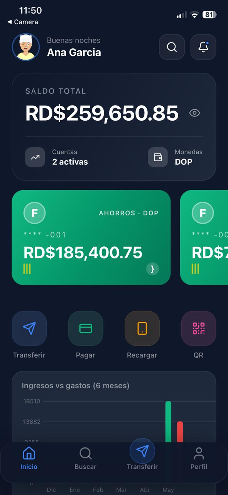
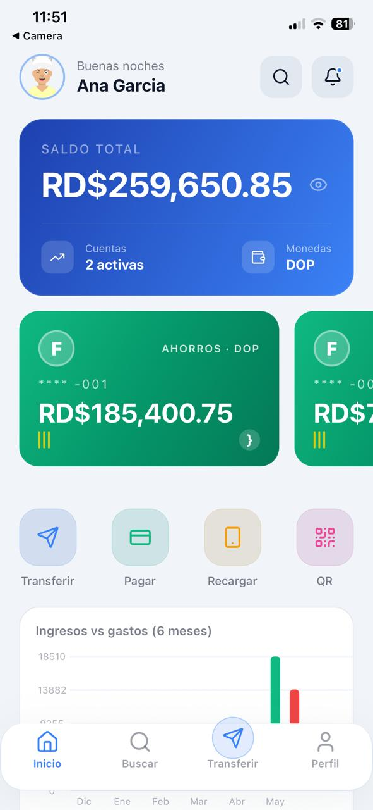
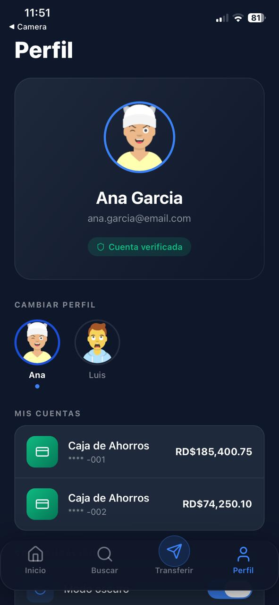
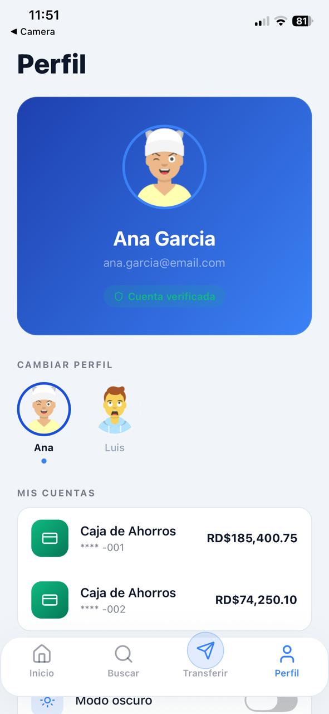
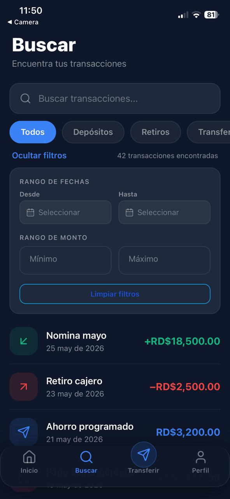
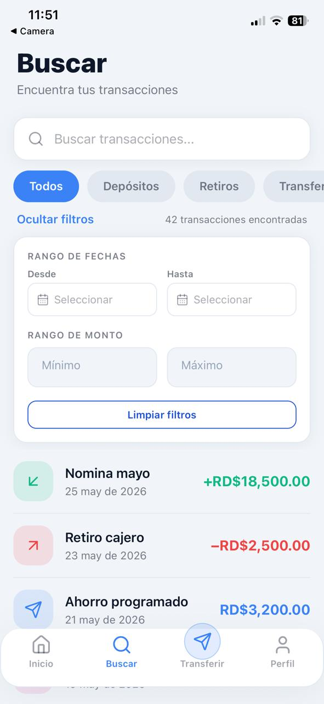
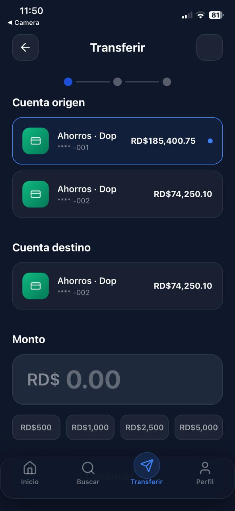
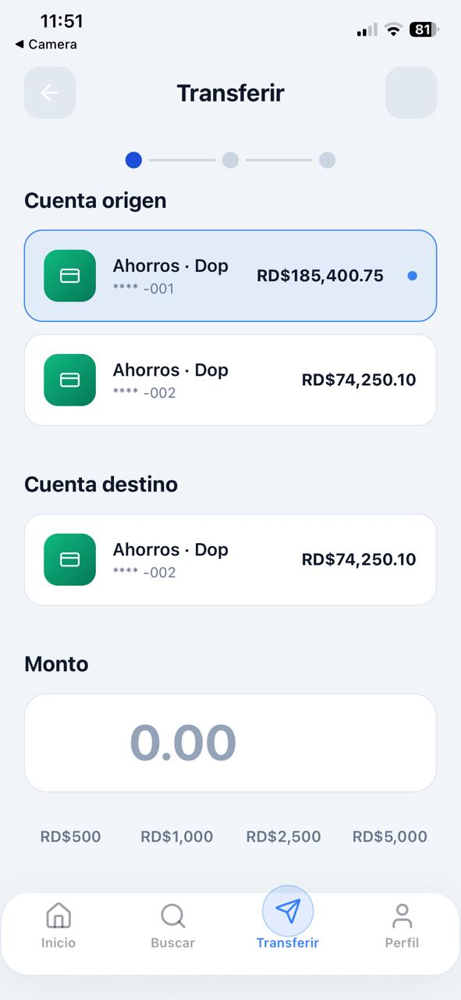

# 🏦 FinBank

<p align="center">
  
  
  
  
  
</p>

<p align="center">
  Aplicación bancaria dominicana construida con Expo. Gestiona cuentas, consulta transacciones y realiza transferencias desde tu móvil.
</p>

---

## 📱 Capturas de pantalla

| Modo Oscuro | Modo Claro |
|---|---|
|  |  |
|  |  |
|  |  |
|  |  |

---

## ✅ Requisitos previos

- **Node.js** 18 o superior
- **npm** o **yarn**
- Aplicación **Expo Go** instalada en tu dispositivo ([iOS](https://apps.apple.com/app/expo-go/id982107779) / [Android](https://play.google.com/store/apps/details?id=host.exp.exponent))

---

## 🚀 Instalación y ejecución

```bash
# Clonar el repositorio
git clone https://github.com/nramirez-dev/finbank
cd finbank

# Instalar dependencias
npm install

# Iniciar el servidor de desarrollo
npx expo start
```

Escanea el código QR con Expo Go para abrir la app en tu dispositivo.

---

## 📋 Comandos disponibles

| Comando | Descripción |
|---|---|
| `npm start` | Inicia el servidor de Metro Bundler |
| `npm test` | Corre los tests en modo interactivo |
| `npm run test:ci` | Corre los tests en modo CI (sin interactividad) |
| `npm run typecheck` | Verifica errores de TypeScript |
| `npm run lint` | Analiza el código con ESLint |
| `npx expo start --web` | Abre la versión web en el navegador |
| `npx expo start --android` | Abre en emulador Android |
| `npx expo start --ios` | Abre en simulador iOS |

---

## 🗂️ Estructura del proyecto

El proyecto combina **Atomic Design** para los componentes con **Clean Architecture** para la lógica de negocio.

```
src/
├── app/                        # Rutas de Expo Router
│   ├── (tabs)/
│   │   ├── index.tsx           # Pantalla de inicio
│   │   ├── search.tsx          # Búsqueda de transacciones
│   │   ├── transfer.tsx        # Transferencias (flujo de 3 pasos)
│   │   └── profile.tsx         # Perfil y cuentas
│   └── transaction/[id].tsx    # Detalle de transacción
│
├── components/                 # Atomic Design
│   ├── atoms/                  # Button, Input, Badge, Skeleton
│   ├── molecules/              # TransactionCard, AccountCard, SearchBar
│   └── organisms/              # AccountSummary, TransferForm, BalanceChart
│
├── domain/
│   ├── entities/               # Account, Transaction, UserProfile
│   └── schemas/                # Validaciones con Zod
│
├── services/                   # Acceso a datos (mock JSON)
├── hooks/                      # Custom hooks con React Query
├── store/                      # Estado global con Zustand
├── data/                       # Mock data (accounts, transactions, profiles)
└── lib/                        # Utilidades: formatCurrency, formatDate, etc.
```

---

## 🏗️ Decisiones técnicas

| Tecnología | Razón |
|---|---|
| **React Query** | Caching automático de datos, estados de carga y error, revalidación en foco |
| **Zustand** | Estado global simple y sin boilerplate para perfil activo y cuenta seleccionada |
| **Zod** | Validación de formularios con esquemas tipados y mensajes de error en español |
| **Atomic Design** | Componentes reutilizables organizados por complejidad: atoms → molecules → organisms |
| **Expo Router** | Navegación basada en archivos, soporte nativo para deep linking |

---

## ✨ Funcionalidades destacadas

- 🌙 **Dark mode** — tema oscuro por defecto con opción de cambio persistido en Zustand
- 📐 **Diseño responsivo** — adaptado a pantallas pequeñas (320px), normales (375px) y grandes (480px+)
- 🏷️ **Íconos por categoría** — cada tipo de transacción tiene su ícono y color representativo
- 🪟 **Glassmorphism cards** — tarjetas con efecto de cristal y bordes translúcidos
- ⏳ **Skeleton loading** — cada pantalla muestra un estado de carga animado mientras se obtienen los datos
- 👁️ **Ocultar saldo** — toggle para mostrar/ocultar el balance total en la pantalla de inicio
- 📊 **Gráfico de balance** — visualización de ingresos vs gastos de los últimos 6 meses
- ✅ **Transferencias con validación** — flujo de 3 pasos con validación Zod y estados de éxito/error

---

## 🎁 Bonus implementados

| Bonus | Implementación |
|---|---|
| 🌙 **Modo oscuro** | Toggle en pantalla de Perfil, persiste entre sesiones con Zustand + AsyncStorage |
| ⚛️ **Atomic Design** | Estructura de componentes: atoms → molecules → organisms → templates |
| 🚀 **Estrategia de caching** | React Query con staleTime de 5 minutos, retry: 1, revalidación automática en foco |

---

## 🧪 Tests

```bash
# Correr todos los tests
npm test

# Modo CI (una sola pasada, sin watcher)
npm run test:ci
```

El proyecto incluye **20 tests** distribuidos entre:
- **Unitarios**: helpers `formatCurrency` y `formatDate`, Zustand stores, esquemas Zod, componentes atoms
- **Integración**: hook `useTransactions`, formulario `TransferForm`, flujo completo de transferencia

---

## 📦 Stack tecnológico

| Capa | Tecnología |
|---|---|
| Framework | Expo SDK 54 + Expo Router v6 |
| Lenguaje | TypeScript 5.9 (strict) |
| Estilos | NativeWind v4 (Tailwind CSS) |
| Server state | TanStack React Query v5 |
| Client state | Zustand v5 |
| Formularios | React Hook Form + Zod |
| Gráficos | react-native-gifted-charts |
| Animaciones | React Native Reanimated v4 |
| Testing | Jest + React Native Testing Library |

---

## 📄 Licencia

Este proyecto es privado y fue desarrollado como práctica de desarrollo móvil con Expo.
